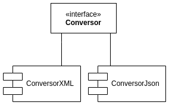

# Projeto

## Projeto arquitetural

## Projeto detalhado

- Biblioteca [Jackson](https://github.com/FasterXML/jackson) para conversão dos arquivos
- [json-schema-validator](https://github.com/java-json-tools/json-schema-validator) para a validação de documentos de entrada JSON, em relação ao JSON Schema correspondente. 
